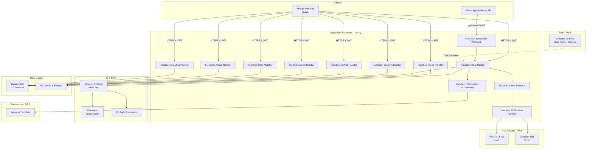
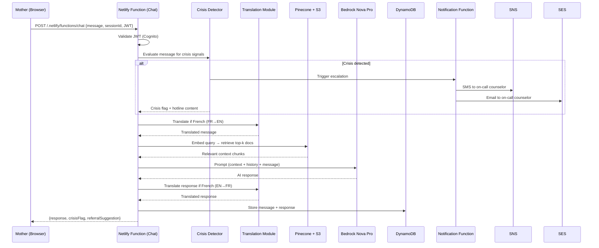
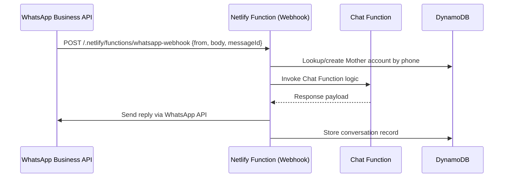

# Design Document: Thriving Mama Platform

## Overview

Thriving Mama is an AI-powered maternal mental health support platform targeting mothers worldwide, with primary cultural adaptation for Africa. The platform delivers 24/7 support through a Next.js web application and a WhatsApp Business API channel, combining an AI chat coach (Amazon Nova Pro via Bedrock with RAG), multilingual support (English, French, Pidgin English), crisis detection with human escalation, mood tracking, EPDS screening, peer community, family portal, and role-specific dashboards for counselors and administrators.

### Design Goals

- **Accessibility first**: WhatsApp channel and voice input lower the barrier for mothers with limited smartphone access or literacy challenges.
- **Cultural sensitivity**: Pidgin English native support via Nova Pro; content grounded in African maternal health context via RAG.
- **Cost efficiency**: Serverless-first architecture (Netlify Functions, DynamoDB on-demand, Pinecone free tier) targets near-zero cost at launch, scaling to $150–300/month at 1,000 users.
- **Safety by design**: Crisis detection runs synchronously before every AI response; escalation is automated and logged.
- **Privacy and consent**: RBAC via Cognito, explicit consent at registration, data deletion within 30 days of request.

### Key Design Decisions

| Decision | Choice | Rationale |
|---|---|---|
| AI model | Amazon Nova Pro (Bedrock) | Cost-effective, supports multilingual including Pidgin English natively |
| Vector store | Pinecone free tier (1 index) | Sufficient for MVP; avoids additional AWS cost |
| Database | DynamoDB on-demand | Serverless, auto-scaling, no idle cost |
| Auth | Amazon Cognito | Managed JWT, RBAC groups, validated via Netlify Functions middleware |
| Hosting | Netlify (free tier) | Free hosting + serverless functions + forms; great Next.js support |
| Backend | Netlify Functions | Serverless, same AWS Lambda runtime under the hood, 125K free invocations/month |
| WhatsApp | WhatsApp Business API → Netlify Function webhook | Industry standard; shares backend logic with web |
| Translation | Amazon Translate (EN↔FR) + Nova Pro (Pidgin) | Translate handles structured language pairs; Nova Pro handles Pidgin natively |
| Scheduling | Netlify Functions + DynamoDB (no third-party) | Avoids external SaaS cost; DynamoDB conditional writes prevent double-booking |
| Email | Amazon SES | Free 62K emails/month; reliable programmatic email |
| SMS (crisis) | Amazon SNS | Only service needed for SMS; pay-per-use |
| Voice | Browser Web Speech API + AWS Transcribe fallback | Zero-cost client-side; Transcribe for WhatsApp voice messages |

---

## Architecture

### High-Level Architecture



### Request Flow: AI Chat (Web)



### Request Flow: WhatsApp Bot



---

## Components and Interfaces

### 1. Authentication & Authorization

**Component**: Amazon Cognito User Pool with three groups: `Mothers`, `Counselors`, `Admins`.

- Netlify Functions validate Cognito JWT tokens in a shared middleware module before processing requests.
- Functions extract the Cognito `sub` (user ID) and `cognito:groups` claim from the JWT to enforce RBAC.
- Public routes (Family Portal read, WhatsApp webhook, registration) bypass JWT validation.

**API Endpoints (Auth)**:

| Method | Path | Auth | Description |
|---|---|---|---|
| POST | `/auth/register` | None | Register new user (Cognito + DynamoDB profile) |
| POST | `/auth/login` | None | Cognito hosted UI / direct auth |
| POST | `/auth/refresh` | None | Refresh JWT token |
| PUT | `/auth/profile` | Mother | Update language preference, consent |
| DELETE | `/auth/account` | Mother | Request account deletion |

### 2. AI Chat Coach

**Component**: `chat` Netlify Function — orchestrates RAG retrieval, translation, Bedrock invocation, crisis detection, and smart referral logic.

- Maintains conversation context by loading the last N messages from DynamoDB before each Bedrock call (sliding window, max 20 turns to control token cost).
- RAG: embeds the (translated) user message using Bedrock Titan Embeddings, queries Pinecone for top-5 chunks, fetches chunk text from S3, injects into the system prompt.
- Smart referral: a secondary Bedrock call (or prompt flag) evaluates whether the conversation warrants a referral after the main response is generated.

**API Endpoints (Chat)**:

| Method | Path | Auth | Description |
|---|---|---|---|
| POST | `/chat/message` | Mother | Send message, receive AI response |
| GET | `/chat/history` | Mother | Retrieve paginated conversation history |
| GET | `/chat/sessions` | Mother | List past chat sessions |

### 3. Crisis Detection

**Component**: `CrisisDetector` — a synchronous module called within the chat function before the Bedrock response is returned.

- Maintains a configurable keyword list in DynamoDB (`crisis_keywords` table), editable by Admins.
- Uses a two-pass approach: (1) fast keyword scan, (2) if keywords match, a secondary Bedrock prompt classifies severity (low/medium/high).
- On HIGH severity: triggers notification function, returns crisis flag + hotline content to the client immediately.
- On MEDIUM severity: returns a supportive message with booking link; no counselor notification.
- Logs every evaluation (keyword match or not) to DynamoDB `crisis_events` table.

### 4. Translation Middleware

**Component**: `TranslationMiddleware` — shared module called inline by the chat function.

- French: Amazon Translate `fr→en` (user message) and `en→fr` (AI response).
- Pidgin English: no translation; Nova Pro handles natively via system prompt instruction.
- English: pass-through.
- Caches translations in-memory within the function execution context to avoid duplicate API calls within a session.

### 5. Voice Input

**Component**: `voice` Netlify Function — accepts audio upload, submits to AWS Transcribe, returns transcript.

- Web app uses Browser Web Speech API (client-side, zero cost) as primary voice input method.
- For WhatsApp voice messages: function downloads audio, uploads to S3, starts Transcribe job.
- On Transcribe error: returns error payload; client falls back to manual text input.

**API Endpoints (Voice)**:

| Method | Path | Auth | Description |
|---|---|---|---|
| POST | `/voice/upload-url` | Mother | Get pre-signed S3 URL for audio upload |
| POST | `/voice/transcribe` | Mother | Start transcription job, return transcript |

### 6. Booking System

**Component**: `booking` Netlify Function — manages counselor slots and session records.

- DynamoDB conditional writes (`ConditionExpression: attribute_not_exists(bookedBy)`) prevent double-booking.
- Slot status: `available | reserved | completed | cancelled`.
- On booking confirmation: invokes notification module to send SES emails to both Mother and Counselor.
- Cancellation allowed ≥24h before session; slot reverts to `available`.

**API Endpoints (Booking)**:

| Method | Path | Auth | Description |
|---|---|---|---|
| GET | `/booking/slots` | Mother | List available slots |
| POST | `/booking/book` | Mother | Book a slot |
| DELETE | `/booking/cancel/{sessionId}` | Mother | Cancel a session |
| POST | `/booking/slots` | Counselor | Create availability slot |
| PUT | `/booking/slots/{slotId}` | Counselor | Update slot |
| DELETE | `/booking/slots/{slotId}` | Counselor | Delete slot |
| GET | `/booking/sessions` | Counselor | List counselor's sessions |

### 7. EPDS Screening

**Component**: `epds` Netlify Function — handles submission, scoring, and history retrieval.

- Scores are calculated server-side (sum of 10 question responses, 0–30 scale).
- Score ≥10: returns booking recommendation in response.
- Score ≥13: additionally invokes `CrisisDetector` escalation flow.
- Periodic reminder: Netlify Scheduled Functions (cron) fire to check which Mothers are due for EPDS, invokes notification module for in-app notification.

**API Endpoints (EPDS)**:

| Method | Path | Auth | Description |
|---|---|---|---|
| POST | `/epds/submit` | Mother | Submit EPDS answers, receive score |
| GET | `/epds/history` | Mother | Retrieve EPDS score history |
| GET | `/epds/history/{motherId}` | Counselor | View Mother's EPDS history |

### 8. Mood Tracking

**Component**: `mood` Netlify Function — handles daily check-in submission and history retrieval.

- Consecutive low mood detection: queries last 3 days on submission; if all ≤2, returns supportive message + booking link.
- Daily reminder: Netlify Scheduled Function (cron) fires daily to check which Mothers haven't checked in, invokes notification module.

**API Endpoints (Mood)**:

| Method | Path | Auth | Description |
|---|---|---|---|
| POST | `/mood/checkin` | Mother | Submit daily mood check-in |
| GET | `/mood/history` | Mother | Retrieve 30-day mood history |
| GET | `/mood/history/{motherId}` | Counselor | View Mother's mood history |

### 9. Peer Matching

**Component**: `peer` Netlify Function — matches Mothers and manages peer messaging threads.

- Matching algorithm: DynamoDB scan/query on `peer_profiles` table filtered by `babyAgeRange`, `languagePreference`, and `challenges` (set intersection score). Returns top 3 matches.
- Messaging: stored in DynamoDB `peer_messages` table; delivery via polling (GET endpoint) or WebSocket (future enhancement).
- Community guidelines: stored in DynamoDB `config` table; returned with first message send response.

**API Endpoints (Peer)**:

| Method | Path | Auth | Description |
|---|---|---|---|
| POST | `/peer/opt-in` | Mother | Opt into peer matching |
| GET | `/peer/matches` | Mother | Get peer match suggestions |
| POST | `/peer/connect` | Mother | Accept a peer connection |
| GET | `/peer/threads` | Mother | List peer message threads |
| POST | `/peer/message` | Mother | Send peer message |
| GET | `/peer/messages/{threadId}` | Mother | Get messages in thread |
| DELETE | `/peer/connection/{peerId}` | Mother | Remove peer connection |

### 10. Family Portal

**Component**: Served by Next.js static/SSR pages; resource metadata from DynamoDB, files from S3.

- Public read access (no auth).
- Admin write access via Admin Dashboard.
- Search: DynamoDB `contains` filter on title/tags (sufficient for MVP; upgrade to OpenSearch if needed).

**API Endpoints (Family Portal)**:

| Method | Path | Auth | Description |
|---|---|---|---|
| GET | `/family/resources` | None | List/search resources |
| GET | `/family/resources/{id}` | None | Get resource detail |
| POST | `/family/resources` | Admin | Add resource |
| PUT | `/family/resources/{id}` | Admin | Update resource |
| DELETE | `/family/resources/{id}` | Admin | Remove resource |

### 11. Counselor Dashboard

**Component**: Next.js page with data fetched from multiple Netlify Function endpoints.

- High-risk list: Mothers with EPDS ≥10, mood ≤2 for 3+ consecutive days, or manually flagged.
- Crisis notifications: polling-based (client fetches from DynamoDB notifications table via function endpoint).

### 12. Admin Dashboard

**Component**: Next.js page; `admin` Netlify Function handles user management and configuration.

- User deactivation: calls Cognito `AdminDisableUser` API; updates DynamoDB user record.
- Crisis keyword management: CRUD on DynamoDB `crisis_keywords` table.
- On-call counselor designation: updates DynamoDB `config` table.

**API Endpoints (Admin)**:

| Method | Path | Auth | Description |
|---|---|---|---|
| GET | `/admin/users` | Admin | List all users |
| PUT | `/admin/users/{userId}` | Admin | Activate/deactivate/change role |
| GET | `/admin/analytics` | Admin | Aggregate metrics |
| GET | `/admin/analytics/export` | Admin | Export CSV report |
| GET | `/admin/crisis-keywords` | Admin | List crisis keywords |
| PUT | `/admin/crisis-keywords` | Admin | Update crisis keywords |
| PUT | `/admin/oncall` | Admin | Set on-call counselor |
| GET | `/admin/counselors/performance` | Admin | Counselor performance summary |

### 13. WhatsApp Bot

**Component**: `whatsapp-webhook` Netlify Function — receives POST from WhatsApp Business API, routes to shared chat function logic.

- Phone number used as external identifier; linked to Cognito account via DynamoDB `whatsapp_accounts` table.
- Onboarding flow: guided multi-step conversation within WhatsApp to register or link account.
- Voice messages: WhatsApp sends audio URL; function downloads, uploads to S3, invokes voice transcription module.

### 14. Notification Service

**Component**: `notify` module — centralised notification dispatcher used by other functions.

- SNS: SMS to on-call counselor phone number (stored in DynamoDB `config`).
- SES: email to counselor and/or mother.
- In-app: stores notification record in DynamoDB `notifications` table; client polls GET endpoint.
- Retry logic: up to 3 retries with exponential backoff (1s, 2s, 4s) on SNS/SES failure; logs failure to DynamoDB.

### 15. Analytics

**Component**: `analytics` Netlify Function — aggregates metrics from DynamoDB event tables.

- Event sourcing: all significant actions write an event record to `analytics_events` table (userId, eventType, timestamp, metadata).
- Aggregation: function queries and aggregates on-demand (acceptable at MVP scale).
- CSV export: function generates CSV in-memory, uploads to S3 with a pre-signed URL, returns URL to client.

---

## Data Models

### DynamoDB Table Design

DynamoDB uses a single-table design pattern where practical, with composite keys to support access patterns efficiently.

#### Table: `users`

| Attribute | Type | Notes |
|---|---|---|
| `PK` | String | `USER#{userId}` |
| `SK` | String | `PROFILE` |
| `userId` | String | Cognito sub |
| `email` | String | |
| `role` | String | `mother \| counselor \| admin` |
| `languagePreference` | String | `en \| fr \| pcm` |
| `consentGiven` | Boolean | |
| `consentTimestamp` | String | ISO 8601 |
| `isActive` | Boolean | |
| `createdAt` | String | ISO 8601 |
| `utcOffset` | Number | For mood reminder scheduling |
| `phoneNumber` | String | Optional; for WhatsApp linking |
| `GSI1PK` | String | `ROLE#{role}` |
| `GSI1SK` | String | `USER#{userId}` |

**GSI1**: Query users by role (Admin user management).

#### Table: `chat_messages`

| Attribute | Type | Notes |
|---|---|---|
| `PK` | String | `USER#{userId}` |
| `SK` | String | `MSG#{timestamp}#{messageId}` |
| `sessionId` | String | Groups messages into sessions |
| `role` | String | `user \| assistant` |
| `content` | String | Message text |
| `language` | String | Language at time of message |
| `crisisFlag` | Boolean | |
| `createdAt` | String | ISO 8601 |
| `GSI1PK` | String | `SESSION#{sessionId}` |
| `GSI1SK` | String | `MSG#{timestamp}` |

**GSI1**: Retrieve all messages in a session ordered by time.

#### Table: `crisis_events`

| Attribute | Type | Notes |
|---|---|---|
| `PK` | String | `CRISIS#{crisisId}` |
| `SK` | String | `EVENT` |
| `userId` | String | Mother's userId |
| `triggeringMessage` | String | |
| `severity` | String | `medium \| high` |
| `snsStatus` | String | `sent \| failed` |
| `sesStatus` | String | `sent \| failed` |
| `retryCount` | Number | |
| `createdAt` | String | ISO 8601 |
| `GSI1PK` | String | `USER#{userId}` |
| `GSI1SK` | String | `CRISIS#{createdAt}` |

#### Table: `epds_results`

| Attribute | Type | Notes |
|---|---|---|
| `PK` | String | `USER#{userId}` |
| `SK` | String | `EPDS#{timestamp}` |
| `score` | Number | 0–30 |
| `answers` | List | 10 answer values |
| `createdAt` | String | ISO 8601 |

#### Table: `mood_checkins`

| Attribute | Type | Notes |
|---|---|---|
| `PK` | String | `USER#{userId}` |
| `SK` | String | `MOOD#{date}` (YYYY-MM-DD) |
| `rating` | Number | 1–5 |
| `note` | String | Optional free text |
| `createdAt` | String | ISO 8601 |

#### Table: `booking_slots`

| Attribute | Type | Notes |
|---|---|---|
| `PK` | String | `COUNSELOR#{counselorId}` |
| `SK` | String | `SLOT#{slotId}` |
| `slotId` | String | UUID |
| `startTime` | String | ISO 8601 |
| `endTime` | String | ISO 8601 |
| `status` | String | `available \| reserved \| completed \| cancelled` |
| `bookedBy` | String | Mother userId (set on booking) |
| `GSI1PK` | String | `STATUS#available` |
| `GSI1SK` | String | `SLOT#{startTime}` |

**GSI1**: Query all available slots sorted by start time (Mother booking view).

#### Table: `sessions`

| Attribute | Type | Notes |
|---|---|---|
| `PK` | String | `SESSION#{sessionId}` |
| `SK` | String | `DETAIL` |
| `sessionId` | String | UUID |
| `motherId` | String | |
| `counselorId` | String | |
| `slotId` | String | |
| `startTime` | String | ISO 8601 |
| `status` | String | `confirmed \| cancelled \| completed` |
| `createdAt` | String | ISO 8601 |
| `GSI1PK` | String | `COUNSELOR#{counselorId}` |
| `GSI1SK` | String | `SESSION#{startTime}` |
| `GSI2PK` | String | `MOTHER#{motherId}` |
| `GSI2SK` | String | `SESSION#{startTime}` |

#### Table: `peer_connections`

| Attribute | Type | Notes |
|---|---|---|
| `PK` | String | `USER#{userId}` |
| `SK` | String | `PEER#{peerId}` |
| `threadId` | String | UUID |
| `status` | String | `active \| removed` |
| `createdAt` | String | ISO 8601 |

#### Table: `peer_messages`

| Attribute | Type | Notes |
|---|---|---|
| `PK` | String | `THREAD#{threadId}` |
| `SK` | String | `MSG#{timestamp}#{messageId}` |
| `senderId` | String | |
| `content` | String | |
| `createdAt` | String | ISO 8601 |

#### Table: `family_resources`

| Attribute | Type | Notes |
|---|---|---|
| `PK` | String | `RESOURCE#{resourceId}` |
| `SK` | String | `DETAIL` |
| `title` | String | |
| `type` | String | `article \| guide \| video` |
| `language` | String | `en \| fr` |
| `s3Key` | String | S3 object key |
| `tags` | StringSet | For search |
| `isPublished` | Boolean | |
| `createdAt` | String | ISO 8601 |
| `GSI1PK` | String | `TYPE#{type}` |
| `GSI1SK` | String | `RESOURCE#{createdAt}` |

#### Table: `analytics_events`

| Attribute | Type | Notes |
|---|---|---|
| `PK` | String | `EVENT#{eventId}` |
| `SK` | String | `DETAIL` |
| `userId` | String | |
| `eventType` | String | e.g. `chat_session_started` |
| `metadata` | Map | Event-specific data |
| `createdAt` | String | ISO 8601 |
| `GSI1PK` | String | `TYPE#{eventType}` |
| `GSI1SK` | String | `EVENT#{createdAt}` |
| `GSI2PK` | String | `DATE#{YYYY-MM}` |
| `GSI2SK` | String | `EVENT#{createdAt}` |

**GSI2**: Monthly aggregation for analytics and CSV export.

#### Table: `config`

| Attribute | Type | Notes |
|---|---|---|
| `PK` | String | `CONFIG` |
| `SK` | String | `crisis_keywords \| oncall_counselor \| community_guidelines` |
| `value` | Map/List/String | Config value |
| `updatedAt` | String | ISO 8601 |
| `updatedBy` | String | Admin userId |

#### Table: `notifications`

| Attribute | Type | Notes |
|---|---|---|
| `PK` | String | `USER#{userId}` |
| `SK` | String | `NOTIF#{timestamp}#{notifId}` |
| `type` | String | `epds_reminder \| mood_reminder \| crisis \| booking` |
| `message` | String | |
| `isRead` | Boolean | |
| `createdAt` | String | ISO 8601 |

#### Table: `access_logs`

| Attribute | Type | Notes |
|---|---|---|
| `PK` | String | `LOG#{logId}` |
| `SK` | String | `DETAIL` |
| `accessorId` | String | Who accessed |
| `targetUserId` | String | Whose data was accessed |
| `resourceType` | String | `chat \| epds \| mood` |
| `createdAt` | String | ISO 8601 |
| `GSI1PK` | String | `TARGET#{targetUserId}` |
| `GSI1SK` | String | `LOG#{createdAt}` |

### S3 Bucket Structure

```
thriving-mama-{env}/
├── rag-documents/          # Curated maternal health content for Pinecone ingestion
│   └── {docId}.txt
├── voice-uploads/          # Temporary audio files for Transcribe (TTL: 24h)
│   └── {userId}/{timestamp}.webm
├── family-resources/       # Family portal articles, guides, videos
│   └── {resourceId}/{filename}
└── exports/                # Monthly CSV reports (pre-signed URL, TTL: 1h)
    └── {YYYY-MM}/{reportId}.csv
```

### Pinecone Index Design

- **Index name**: `thriving-mama-rag` (single index, free tier)
- **Dimensions**: 1536 (Bedrock Titan Embeddings v2)
- **Metric**: cosine
- **Metadata fields**: `docId`, `source`, `language`, `category` (e.g., `postpartum_depression`, `anxiety`, `breastfeeding`)
- **Namespace**: `en` for English documents; `fr` for French documents
- **Query**: top-5 chunks per message; filter by `language` namespace matching Mother's preference

---

## Correctness Properties

*A property is a characteristic or behavior that should hold true across all valid executions of a system — essentially, a formal statement about what the system should do. Properties serve as the bridge between human-readable specifications and machine-verifiable correctness guarantees.*


### Property Reflection

Before writing the final properties, I'll review for redundancy:

- **Registration storage (1.2) and language preference storage (1.6)**: Both test that registration data is stored in DynamoDB. They can be combined into a single "registration round-trip" property that verifies all profile fields (including language preference) are stored.
- **Crisis SNS (5.3) and Crisis SES (5.4)**: Both test that crisis notifications are dispatched. They can be combined into a single "crisis notification dispatch" property.
- **Booking confirmation emails to Mother (7.4) and Counselor (7.5)**: Both test SES invocation on booking. Combined into one "booking confirmation notifications" property.
- **EPDS score ≥10 booking recommendation (8.3) and EPDS score ≥13 crisis escalation (8.4)**: These are distinct threshold behaviors with different outcomes — kept separate.
- **Peer message send (10.4) and peer message delivery (10.5)**: 10.5 is a performance requirement; 10.4 covers the functional property. Keep 10.4 only.
- **Access control (1.8) and counselor data restriction (16.5)**: Both test RBAC. 16.5 is more specific (counselor/mother relationship). Keep both as they test different dimensions.
- **Crisis logging (5.7) and smart referral logging (6.5)**: Both test event logging. Keep separate as they test different event types.
- **Mood storage (9.2) and consecutive low mood detection (9.4)**: Different behaviors — keep separate.

After reflection, the final property set is:

### Property 1: Registration Round-Trip

*For any* valid registration input (email, password, role, language preference), submitting the registration form should result in a Cognito account being created and a DynamoDB profile record containing all submitted fields including the language preference.

**Validates: Requirements 1.2, 1.6**

### Property 2: Login Issues Valid JWT

*For any* registered user with valid credentials, submitting a login request should return a JWT token containing the correct role claim (`cognito:groups`) matching the user's registered role.

**Validates: Requirements 1.4**

### Property 3: Role-Based Access Control

*For any* (user role, API endpoint) pair where the role is not authorized to access that endpoint, the API Gateway should return a 403 Forbidden response and deny access to the resource.

**Validates: Requirements 1.8, 16.7**

### Property 4: Password Validation Rejects Invalid Inputs

*For any* password that violates at least one of the minimum requirements (length < 8, no uppercase, no lowercase, no number), the registration endpoint should reject the password and return a descriptive validation error.

**Validates: Requirements 1.9**

### Property 5: Chat Response Generation

*For any* valid message sent by a Mother, the chat handler should return a non-empty AI response. The response should be in the Mother's stored preferred language (English, French, or Pidgin English).

**Validates: Requirements 2.2, 2.8**

### Property 6: Conversation Context Preservation

*For any* sequence of N messages within a single chat session (N ≥ 2), the prompt sent to Bedrock for the Nth message should include the prior messages from that session (up to the context window limit of 20 turns).

**Validates: Requirements 2.5**

### Property 7: Conversation History Storage Round-Trip

*For any* message sent by a Mother, the message and its AI response should be stored in DynamoDB and be retrievable via the conversation history endpoint, associated with the correct session and user.

**Validates: Requirements 2.6**

### Property 8: French Translation Pipeline

*For any* message sent by a Mother with French language preference, the system should invoke Amazon Translate with the `fr→en` language pair before sending to Bedrock, and invoke Amazon Translate with the `en→fr` language pair before returning the response to the Mother.

**Validates: Requirements 3.2**

### Property 9: Language Preference Change Persistence

*For any* language preference update (en, fr, or pcm), the new preference should be stored in DynamoDB and all subsequent chat messages in the same session should use the updated language routing.

**Validates: Requirements 3.5**

### Property 10: Voice Recording Duration Limit

*For any* audio upload with duration exceeding 2 minutes, the voice handler should reject the upload and return an error response before invoking AWS Transcribe.

**Validates: Requirements 4.5**

### Property 11: Voice Transcription Round-Trip

*For any* valid audio input within the 2-minute limit, the voice handler should invoke AWS Transcribe and return the resulting transcript text to the client.

**Validates: Requirements 4.3**

### Property 12: Crisis Detection Always Runs

*For any* message processed by the chat handler, the crisis detector should be invoked before the AI response is returned to the client.

**Validates: Requirements 5.1, 5.2**

### Property 13: Crisis Notification Dispatch

*For any* message that triggers a HIGH severity crisis detection, the notification handler should invoke both Amazon SNS (SMS) and Amazon SES (email) with the on-call counselor's contact details and the triggering message summary.

**Validates: Requirements 5.3, 5.4**

### Property 14: Crisis Response Includes Hotline Information

*For any* message that triggers crisis detection, the chat response returned to the Mother should include emergency hotline contact information.

**Validates: Requirements 5.5**

### Property 15: Crisis Event Logging

*For any* triggered crisis event, a record should be written to DynamoDB containing the Mother's identifier, the triggering message, the severity level, the notification delivery status, and a timestamp.

**Validates: Requirements 5.7**

### Property 16: Crisis Notification Retry

*For any* SNS or SES notification failure during crisis escalation, the system should retry delivery up to 3 times with exponential backoff, and log the final failure status in DynamoDB if all retries are exhausted.

**Validates: Requirements 5.8**

### Property 17: Smart Referral Logging

*For any* smart referral triggered by the AI coach, a record should be written to DynamoDB containing the Mother's identifier, the timestamp, and the AI reasoning summary.

**Validates: Requirements 6.5**

### Property 18: Slot Booking State Transition

*For any* available booking slot, when a Mother confirms a booking, the slot status should atomically transition to `reserved` in DynamoDB and a Session record should be created linking the Mother and Counselor.

**Validates: Requirements 7.3**

### Property 19: Booking Confirmation Notifications

*For any* confirmed booking, Amazon SES should be invoked twice — once with the Mother's email address and once with the Counselor's email address — each containing the session date, time, and relevant participant details.

**Validates: Requirements 7.4, 7.5**

### Property 20: Session Cancellation State Transition

*For any* confirmed session with a start time more than 24 hours in the future, when the Mother cancels, the associated slot status should revert to `available` in DynamoDB and SES cancellation emails should be dispatched to both the Mother and Counselor.

**Validates: Requirements 7.7**

### Property 21: Double-Booking Prevention

*For any* two concurrent booking attempts on the same slot, exactly one should succeed (slot transitions to `reserved`) and the other should receive an availability error, enforced by DynamoDB conditional writes.

**Validates: Requirements 7.8**

### Property 22: EPDS Score Calculation and Storage

*For any* valid set of 10 EPDS question answers (each in the valid range), the calculated score should equal the arithmetic sum of the answers, and the score along with all answers should be stored in DynamoDB with the Mother's identifier and submission timestamp.

**Validates: Requirements 8.2**

### Property 23: EPDS Score Threshold — Booking Recommendation

*For any* EPDS submission where the calculated score is 10 or above, the response should include a booking recommendation with a direct link to the Booking System.

**Validates: Requirements 8.3**

### Property 24: EPDS Score Threshold — Crisis Escalation

*For any* EPDS submission where the calculated score is 13 or above, the crisis escalation flow should be triggered in addition to the booking recommendation.

**Validates: Requirements 8.4**

### Property 25: Mood Check-In Storage Round-Trip

*For any* mood check-in submission with a rating between 1 and 5 and an optional note, all submitted fields (rating, note, Mother identifier, timestamp) should be stored in DynamoDB and be retrievable via the mood history endpoint.

**Validates: Requirements 9.2**

### Property 26: Consecutive Low Mood Detection

*For any* sequence of 3 or more consecutive daily mood check-ins where every rating is 1 or 2, the check-in submission response should include a supportive message and a direct link to the Booking System.

**Validates: Requirements 9.4**

### Property 27: Peer Match Attribute Overlap

*For any* Mother profile that opts into peer matching, every returned peer match should share at least one matching attribute (baby age range, language preference, or self-reported challenge) with the requesting Mother.

**Validates: Requirements 10.1**

### Property 28: Peer Match Count Invariant

*For any* Mother profile that opts into peer matching, the number of returned peer matches should be between 0 and 3 (inclusive).

**Validates: Requirements 10.2**

### Property 29: Peer Connection Enables Messaging

*For any* accepted peer connection, a peer relationship record should be created in DynamoDB with status `active`, and both Mothers should be able to send and retrieve messages in the associated thread.

**Validates: Requirements 10.3, 10.4**

### Property 30: Peer Connection Removal Disables Thread

*For any* active peer connection, when either Mother removes the connection, the connection status should be set to `removed` in DynamoDB and subsequent message sends to that thread should be rejected.

**Validates: Requirements 10.6**

### Property 31: Family Portal Search Relevance

*For any* keyword search on the Family Portal, all returned resources should contain the search keyword in their title or tags field.

**Validates: Requirements 11.4**

### Property 32: Counselor Data Access Restriction

*For any* Counselor attempting to access the health records (conversation history, EPDS scores, mood data) of a Mother with whom they have no active or past Session and who has not been flagged as high-risk, the API should return a 403 Forbidden response.

**Validates: Requirements 16.5**

### Property 33: Health Record Access Logging

*For any* successful access to a Mother's health records (conversation history, EPDS scores, or mood data), an access log entry should be written to DynamoDB containing the accessor's identifier, the target Mother's identifier, the resource type, and a timestamp.

**Validates: Requirements 16.6**

### Property 34: Consent Storage at Registration

*For any* Mother registration, the consent field and consent timestamp should be stored in DynamoDB as part of the user profile record.

**Validates: Requirements 16.3**

### Property 35: Analytics Event Completeness

*For any* set of platform events (registrations, chat sessions, EPDS submissions, mood check-ins, crisis events, bookings, referrals), all events should appear in the analytics export for the corresponding time period, with no events omitted.

**Validates: Requirements 15.1, 15.5**

---

## Error Handling

### Error Response Format

All API endpoints return a consistent JSON error envelope:

```json
{
  "error": {
    "code": "BOOKING_SLOT_UNAVAILABLE",
    "message": "The selected slot is no longer available. Please choose another time.",
    "requestId": "abc-123"
  }
}
```

### Error Categories and Handling

| Category | HTTP Status | Handling Strategy |
|---|---|---|
| Authentication failure | 401 | Return error; prompt re-auth |
| Authorization failure | 403 | Return error; redirect to role home |
| Validation error | 400 | Return field-level error details |
| Resource not found | 404 | Return descriptive message |
| Conflict (double-booking) | 409 | Return next available slots |
| AI service timeout | 504 | Return fallback message; log to DynamoDB |
| Translation service error | 500 | Pass message untranslated; log error |
| Transcription error | 500 | Return error; prompt manual text input |
| Notification delivery failure | — | Retry 3x with backoff; log failure |
| DynamoDB write failure | 500 | Return error; do not silently fail |

### Crisis Detection Failure Handling

If the crisis detector itself fails (function error, Bedrock timeout), the system defaults to **safe mode**: the chat response is withheld, an error is returned to the client, and the failure is logged. This prevents a broken crisis detector from silently passing dangerous messages through.

### Bedrock / RAG Fallback

If Pinecone is unavailable, the chat handler falls back to Bedrock without RAG context and includes a note in the response indicating general guidance. If Bedrock itself is unavailable, the chat handler returns a graceful error message directing the Mother to emergency resources.

### WhatsApp Webhook Reliability

The WhatsApp webhook function returns HTTP 200 immediately upon receipt to prevent WhatsApp from retrying. Processing is handled within the same invocation. If processing fails, the error is logged and the Mother receives a fallback message on the next interaction.

---

## Testing Strategy

### Overview

The platform uses a dual testing approach:
- **Unit tests**: Verify specific examples, edge cases, error conditions, and component logic in isolation.
- **Property-based tests**: Verify universal properties across many generated inputs, covering the correctness properties defined above.

Both are complementary. Unit tests catch concrete bugs; property tests verify general correctness across the input space.

### Property-Based Testing

**Library**: [fast-check](https://github.com/dubzzz/fast-check) (TypeScript/JavaScript, works with Jest/Vitest)

**Configuration**: Minimum 100 iterations per property test (`numRuns: 100`).

**Tag format**: Each property test is tagged with a comment:
```
// Feature: thriving-mama-platform, Property N: <property_text>
```

**Scope**: Property tests run against Netlify Function handler logic with AWS services mocked (DynamoDB, Bedrock, SNS, SES, Pinecone, Amazon Translate, AWS Transcribe). This keeps tests fast, cost-free, and deterministic.

**Key property test areas**:

| Property | Test Focus | Generators |
|---|---|---|
| 1 (Registration Round-Trip) | Registration handler | Random email, password, role, language |
| 3 (RBAC) | API Gateway authorizer + Lambda handlers | Random role/endpoint combinations |
| 4 (Password Validation) | Registration validation logic | Passwords violating each rule |
| 5 (Chat Response) | Chat Lambda with mocked Bedrock | Random message strings, language preferences |
| 6 (Context Preservation) | Chat Lambda prompt construction | Random message sequences (2–20 messages) |
| 7 (History Round-Trip) | Chat Lambda + DynamoDB mock | Random messages |
| 8 (French Translation) | Translation middleware | Random French strings |
| 10 (Voice Duration Limit) | Voice handler | Random audio durations (0–300 seconds) |
| 12 (Crisis Detection Always Runs) | Chat Lambda | Random messages |
| 13 (Crisis Notification Dispatch) | Crisis detector + notification handler | Crisis-triggering messages |
| 15 (Crisis Event Logging) | Crisis detector + DynamoDB mock | Crisis events |
| 16 (Crisis Retry) | Notification handler with failing mocks | Simulated SNS/SES failures |
| 18 (Slot Booking State Transition) | Booking Lambda + DynamoDB mock | Random slot/user combinations |
| 21 (Double-Booking Prevention) | Booking Lambda concurrent calls | Concurrent booking attempts |
| 22 (EPDS Score Calculation) | EPDS Lambda scoring logic | Random 10-answer arrays |
| 23 (EPDS Threshold ≥10) | EPDS Lambda | Scores 10–30 |
| 24 (EPDS Threshold ≥13) | EPDS Lambda | Scores 13–30 |
| 25 (Mood Storage Round-Trip) | Mood Lambda + DynamoDB mock | Random ratings 1–5, optional notes |
| 26 (Consecutive Low Mood) | Mood Lambda | Sequences of 3+ consecutive low ratings |
| 27 (Peer Match Attribute Overlap) | Peer matcher algorithm | Random Mother profiles |
| 28 (Peer Match Count) | Peer matcher algorithm | Random Mother profiles |
| 31 (Family Portal Search) | Search handler | Random keywords and resource sets |
| 32 (Counselor Access Restriction) | Authorization middleware | Random counselor/mother pairs |
| 33 (Access Logging) | Health record endpoints + DynamoDB mock | Random access events |
| 35 (Analytics Completeness) | Analytics Lambda + CSV export | Random event sets |

### Unit Tests

Unit tests cover:
- Specific examples demonstrating correct behavior (e.g., a known EPDS answer set produces the expected score)
- Integration points between components (e.g., chat handler correctly assembles the Bedrock prompt)
- Edge cases not covered by property generators (e.g., empty RAG results, Transcribe error response)
- UI component rendering (Next.js components with React Testing Library)

### Integration Tests

Integration tests (run against a staging environment with real AWS services):
- WhatsApp webhook end-to-end flow
- Pinecone RAG retrieval with real embeddings
- Netlify Scheduled Functions for EPDS and mood reminders
- Cognito user pool group enforcement

### Smoke Tests

Smoke tests (run post-deployment):
- All API endpoints return expected status codes
- Cognito user pool groups exist (Mother, Counselor, Admin)
- DynamoDB and S3 encryption enabled
- Family Portal endpoints accessible without auth
- Crisis keyword configuration loaded from DynamoDB

### Test Framework

- **Unit + Property tests**: Vitest + fast-check (TypeScript)
- **Integration tests**: Jest + AWS SDK v3 (against staging)
- **Smoke tests**: Lightweight shell scripts or Postman collection
- **CI**: GitHub Actions — unit + property tests on every PR; integration tests on merge to main; smoke tests post-deployment via Netlify deploy hooks
